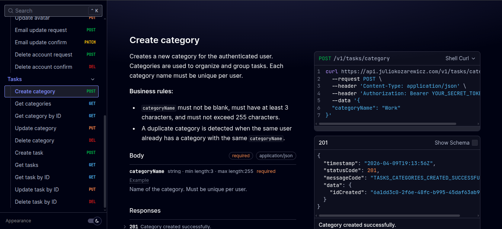

# 📅 Dolistico

**Personal Task & Event Scheduling API — Microservices Architecture**

## About

**Dolistico** is a REST API for personal task and event scheduling — built for individuals who want a reliable backend to manage their agenda, track to-dos, and organize events in one place.

Under the hood, it runs on a microservices architecture designed with a strong focus on performance, scalability, and security. Services communicate asynchronously through Apache Kafka, ensuring loose coupling and high resilience across the platform.

The codebase is structured around Clean Architecture and Domain-Driven Design principles, keeping business logic isolated from infrastructure concerns and making the system easy to extend and maintain over time. Each microservice owns its own domain, data, and lifecycle — from account management and authentication to email dispatch and scheduling.

Security is treated as a first-class concern: all requests are authenticated via JWT with Refresh Token support, identity is managed through Keycloak, and sensitive data is protected with advanced encryption. A rate limiter sits at the gateway level to guard against abuse and DDoS attempts.

Observability is built in from the ground up, with structured logging ready for integration with modern monitoring stacks. Well-defined test and production profiles, combined with Kubernetes deployment using Kustomize overlays, make the transition from local development to production straightforward and reliable.

 

 

## Microservices

Dolistico is not a single application — it is a system composed of independent services, each with its own responsibility, codebase, and data. They communicate through Kafka events and expose their functionality through a unified entry point managed by the NGINX API Gateway.

This design means each service can be developed, deployed, and scaled independently. A spike in scheduling requests does not affect the email service. A new feature in the account service does not require touching the task engine. The system grows without becoming a monolith.

Every service is built with the same principles: Clean Architecture, DDD, structured error handling, input validation, full test coverage, and OpenAPI documentation. They all share the same deployment strategy — containerized with Docker and orchestrated with Kubernetes using Kustomize overlays for dev and prod environments.

## Architecture

- **Microservices** with API Gateway via **NGINX**
- **Event-driven** with **Apache Kafka**
- **Clean Architecture** + **Domain-Driven Design (DDD)**
- **Clean Code**
- Well-defined **test** and **production** profiles

## Tech Stack

### Backend
| Technology | Purpose |
|---|---|
| Java | Primary language |
| Spring | Core framework |
| Hibernate + Spring Data JPA | Persistence layer |
| Flyway | Database migrations |
| Lombok | Boilerplate reduction |

### Databases
| Technology | Purpose |
|---|---|
| PostgreSQL | Primary database |
| H2 Database | Testing |
| Redis | Caching |

### Security
| Technology | Purpose |
|---|---|
| JWT + Refresh Token | Authentication |
| Keycloak | Identity management |
| Advanced encryption | Sensitive data protection |
| Rate Limiter | DDoS protection |

### Infrastructure
| Technology | Purpose |
|---|---|
| Docker | Containerization |
| Docker Compose | Local environment |
| Kubernetes | Deploy (dev and prod with Kustomize) |
| NGINX | API Gateway |

## Quality & Observability

- **Testing:** JUnit · Mockito · JaCoCo (code coverage)
- **Structured logging** ready for integration with modern monitoring tools
- **Error Handler** with robust, centralized error management
- **Input validation** on all endpoints

## Documentation

- **OpenAPI** — full endpoint documentation
- **UML** — Sequence, Class, and Activity diagrams

  Dolistico — Built with Java & Spring

